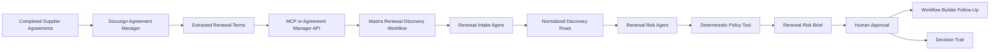

# Architecture

## Agent Roles

### Renewal Intake Agent

- Invoked by the Mastra workflow as the first agent step.
- Pulls completed supplier agreements from Agreement Manager.
- Filters for agreements renewing in the next 90 days.
- Normalizes extracted renewal terms into consistent discovery rows.

### Renewal Risk Agent

- Invoked by the Mastra workflow after intake, not by direct agent-to-agent handoff.
- Reviews each agreement against the procurement renewal policy.
- Classifies renewal risk through deterministic policy tools.
- Explains the reasoning.
- Recommends one follow-up action per agreement.
- Produces a structured portfolio-level renewal-risk brief.

### Human Reviewer

- Confirms whether to approve renewal, start renegotiation, send cancellation notice, route to legal, or mark no action needed.
- Keeps the process governed and auditable.
