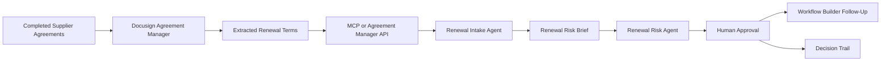

# Architecture

## Agent Roles

### Renewal Intake Agent

- Pulls completed supplier agreements from Agreement Manager.
- Filters for agreements renewing in the next 90 days.
- Normalizes extracted renewal terms into a consistent brief.
- Produces a portfolio-level renewal-risk brief.

### Renewal Risk Agent

- Reviews each agreement against the procurement renewal policy.
- Classifies renewal risk.
- Explains the reasoning.
- Recommends one follow-up action per agreement.

### Human Reviewer

- Confirms whether to approve renewal, start renegotiation, send cancellation notice, route to legal, or mark no action needed.
- Keeps the process governed and auditable.

